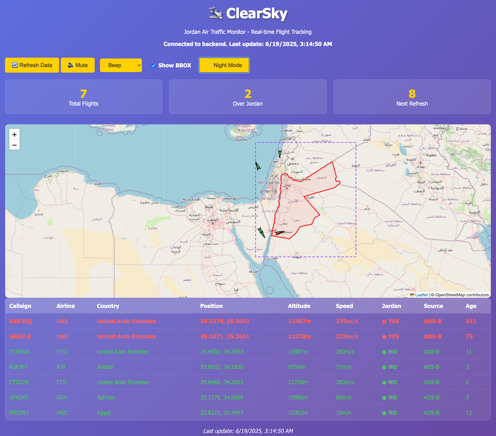
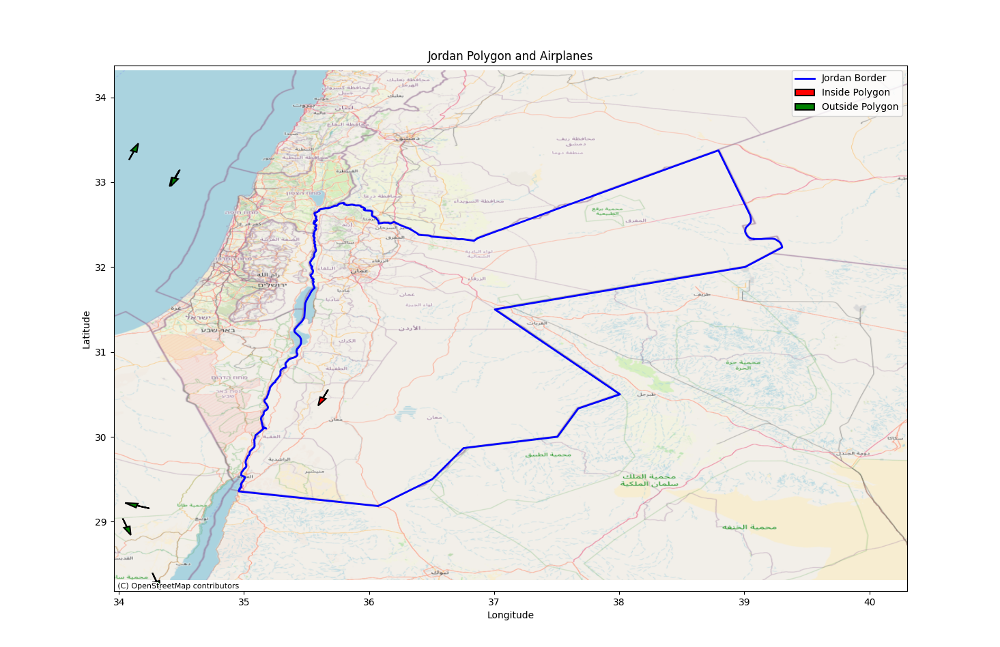

# ClearSky: Jordan Air Traffic Monitor

ClearSky is a Python application that visualizes real-time air traffic over Jordan using the OpenSky Network API and OpenStreetMap basemaps. It fetches live flight data, highlights flights inside and outside Jordan's borders, and provides a beautiful, interactive map with live updates.

## Features
- **Live Air Traffic Visualization**: See all flights in and around Jordan, updated every minute.
- **Polygonal Border Detection**: Flights are classified as inside or outside Jordan using precise geo-boundary data.
- **OpenStreetMap Basemap**: High-quality map tiles for geographic context.
- **Interactive Plot**: Resize, move, and interact with the window while data updates.
- **OAuth2 Authentication**: Secure access to the OpenSky API.
- **Audible Alerts**: Custom beeps based on the number of flights over Jordan.
- **Debug Output**: Console logs for API rate limits, errors, and flight tables.

## Requirements
- Python 3.8+
- See `requirements.txt` for all dependencies:
  - requests
  - shapely
  - matplotlib
  - contextily
  - pyproj
  - PyQt5

## Installation
1. **Clone the repository:**
   ```bash
   git clone <your-repo-url>
   cd ClearSky
   ```
2. **Install dependencies (preferably with [uv](https://github.com/astral-sh/uv))**:
   ```bash
   uv pip install -r requirements.txt
   # or, if you must:
   pip install -r requirements.txt
   ```
3. **Add your OpenSky credentials:**
   - Create a `credentials.json` file in the project root with the following format:
     ```json
     {
       "clientId": "YOUR_CLIENT_ID",
       "clientSecret": "YOUR_CLIENT_SECRET"
     }
     ```

## Usage
Run the main script:
```bash
python clearsky.py
```
- The application will open a window showing Jordan's border and all flights in the bounding box.
- Flights inside the polygon are shown in red, outside in green.
- The console will show a table of flights and API rate limit info.
- Audible beeps indicate the number of flights over Jordan.

## Web Server (Alternative Interface)
ClearSky also includes a web-based interface that can be accessed from any browser:

### Start the HTTP Server
```bash
python clearsky_server.py
```
- Server runs on `http://localhost:8080`
- No additional dependencies required (uses built-in Python HTTP server)
- Automatically starts background data fetching thread

### Web Interface Features
- **Interactive Map**: Leaflet-based map with OpenStreetMap tiles
- **Real-time Updates**: Flight data refreshes every 60 seconds
- **Sortable Table**: Click column headers to sort flight data
- **Tooltips**: Hover over airplane markers to see callsigns
- **Sound Controls**: Mute/unmute and select from 9 different beep sounds
- **Countdown Timer**: Shows seconds until next refresh
- **Responsive Design**: Works on desktop and mobile devices

### API Endpoints
The server provides several REST endpoints:
- `GET /` - Main web interface (serves `index.html`)
- `GET /api/flights` - JSON data of all flights with statistics
- `GET /api/jordan_polygon` - GeoJSON of Jordan's border polygon
- `GET /api/stats` - Flight statistics only
- `GET /api/jordan` - Flights over Jordan only

### Web Interface Controls
- **🔄 Refresh Data**: Manual refresh button
- **🔊 Mute/🔇 Unmute**: Toggle sound alerts
- **Sound Dropdown**: Choose from beep, chime, ding, pop, click, ping, tada, error, success, or random
- **Table Sorting**: Click any column header to sort (▲ ascending, ▼ descending)

## Customization
- **Bounding Box & Padding**: Adjust `PADDING` in `clearsky.py` to change the area of interest.
- **Update Interval**: Change `INTERVAL` (in minutes) for how often data is refreshed.
- **Arrow/Marker Settings**: Tweak `ARROW_LENGTH`, `ARROW_WIDTH`, etc. for visualization style.

- **API Rate Limits**: The OpenSky API enforces rate limits. Watch the console for `[RATE LIMIT]` messages.

## File Structure
- `clearsky.py` — Main application logic
- `clearsky_server.py` — HTTP server for web interface
- `index.html` — Web interface frontend
- `requirements.txt` — Python dependencies
- `.gitignore` — Files and folders ignored by git
- `credentials.json` — Your (private) OpenSky credentials (not tracked by git)
- `map.png` — Screenshot for README



CLI Map

*Created for the one and only Ultimate Boss. All bugs are the user's fault.*
 